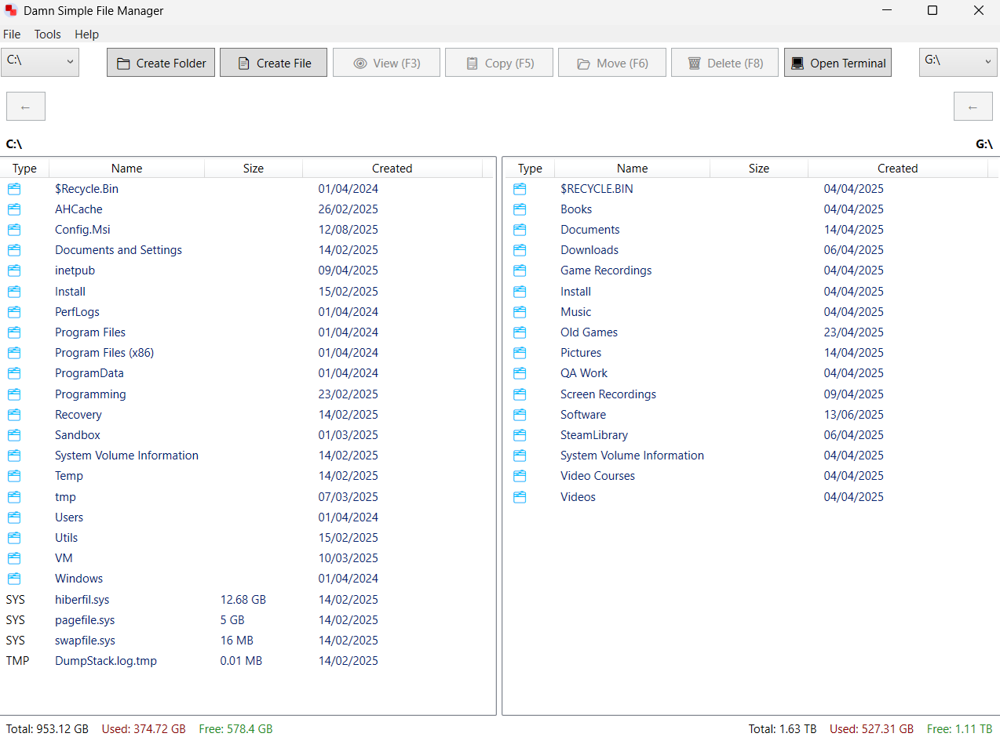

# Damn Simple File Manager



Damn Simple File Manager is a lightweight two-pane file manager for Windows built with WPF. It provides basic file operations such as browsing directories, creating folders and files, copying, moving, and deleting items.

The application is intentionally minimalistic and aims to offer a straightforward file management experience without unnecessary complexity.

## Features

- Dual-pane interface for easy file operations
- Keyboard support and simple navigation
- Create, copy, move, and delete files or folders
- Sortable columns (Name, Size, Type, Created) with default sort by file type
- Displays drive information and available space
- Tools menu including utilities like **Lynkr** for managing links and File Bookmarks
- Localization support in English, Russian, and Spanish
- Configurable behavior via `dsfm.ini`

## Bookmarks

Bookmark your favorite folders and links for quick access.

### URL Bookmarks


### File Bookmarks


## Configuration

`dsfm.ini` is created automatically next to the application.
Set `hidden_files=false` to hide files and folders marked as hidden.
Set `copy_confirmation=false` to copy files and folders without confirmation.
Set `move_confirmation=false` to move files and folders without confirmation.
Set `recycle_bin_delete=false` to delete items permanently instead of using the Recycle Bin.
Set `dark_theme=true` to enable the dark theme (experimental).

## Keyboard Shortcuts

- **F2** – Rename selected files or folders
- **F5** – Copy selected files or folders to the opposite pane
- **F6** – Move selected files or folders to the opposite pane
- **F7** – Create a new folder
- **Shift+F7** – Create a new file
- **F8** – Delete selected files or folders (with confirmation)

## Building

This project targets .NET 9 and uses WPF. To build the application, run:

```
dotnet build
```

## License

This project is released under the MIT License.
